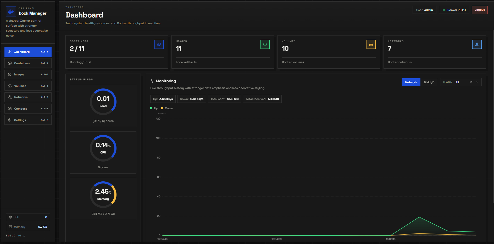

# Docker Manager - Desktop Application

Ứng dụng desktop quản lý Docker mạnh mẽ với giao diện trực quan, cho phép theo dõi và điều khiển toàn bộ hệ thống Docker từ một nơi duy nhất.

[](https://github.com/ngthanhvu/docker-manager/stargazers)
[](https://github.com/ngthanhvu/docker-manager/forks)
[](./LICENSE)
[](https://github.com/ngthanhvu/docker-manager/commits/main)
[](https://tauri.app/)


## Tính năng chính

- **Dashboard**: Theo dõi sức khỏe hệ thống, tài nguyên và throughput của Docker theo thời gian thực
- **Containers**: Quản lý vòng đời container (start, stop, restart, remove)
- **Images**: Xem và quản lý các Docker images local
- **Volumes**: Quản lý Docker volumes
- **Networks**: Cấu hình và quản lý Docker networks
- **Compose**: Hỗ trợ Docker Compose cho multi-container applications
- **Monitoring**: Biểu đồ theo dõi network throughput, disk I/O, CPU và memory usage

## Công nghệ sử dụng

| Component | Technology |
|-----------|------------|
| Frontend | Vue 3 + Vite |
| Backend API | Go (port `:8080`) |
| Desktop Shell | Tauri v2 |
| Styling | Bootstrap + Material Design |

## Cấu trúc dự án

```
docker-manager/
├── frontend/          # Giao diện Vue 3 với các component UI
├── backend/           # REST API Go xử lý các thao tác Docker
├── src-tauri/         # Cấu hình và mã nguồn Tauri desktop
├── docker-compose.yml # Cấu hình dev environment
├── docker-compose.prod.yml # Cấu hình production environment
├── run-dev.sh         # Script chạy dev environment
└── run-prod.sh        # Script chạy production environment
```

## Yêu cầu môi trường

| Yêu cầu | Phiên bản | Ghi chú |
|---------|-----------|---------|
| Hệ điều hành | Windows 10/11 | |
| Docker | Docker Desktop hoặc Docker Engine | Phải đang chạy trước khi mở app |
| Node.js | LTS | Kèm npm |
| Go | Theo `backend/go.mod` | |
| Rust | Latest | Cho Tauri build |

## Chạy dev

Có 2 cách để chạy môi trường development:

### Cách 1: Chạy trực tiếp (không dùng Docker)

Mở 2 terminal tại thư mục gốc project:

1. **Chạy backend (Go):**
```powershell
cd backend
go mod download
go run .
```

2. **Chạy app Tauri:**
```powershell
cd ..
npm --prefix frontend install
npx tauri dev
```

> **Ghi chú:**
> - Frontend sẽ chạy dev server tại `http://localhost:5173` (do Tauri tự gọi qua `beforeDevCommand`)
> - Backend API ở `http://localhost:8080`

### Cách 2: Chạy bằng Docker

```bash
./run-dev.sh
```

Service sẽ chạy tại:
- Frontend: `http://localhost:5173`
- Backend: `http://localhost:8080`

## Build bản phát hành

Để build ứng dụng thành file installer cho người dùng cuối:

```powershell
npm --prefix frontend install
npx tauri build
```

**Output sau khi build:**

| Đường dẫn | Loại file | Mô tả |
|-----------|-----------|-------|
| `src-tauri/target/release/bundle/msi/` | `.msi` | Windows Installer |
| `src-tauri/target/release/bundle/nsis/` | `.exe` | NSIS Installer (nếu có) |

## Cài đặt cho người dùng cuối

1. Gửi file installer trong thư mục `bundle` (`.msi` hoặc `.exe`) cho người dùng
2. Người dùng chạy file installer để cài đặt ứng dụng
3. **Quan trọng:** Đảm bảo Docker đang chạy trước khi mở ứng dụng

## Production Environment với Docker

Project hỗ trợ chạy môi trường production bằng Docker với các file cấu hình:

| File | Mô tả |
|------|-------|
| `docker-compose.yml` | Cấu hình development |
| `docker-compose.prod.yml` | Cấu hình production |
| `backend/Dockerfile` | Dockerfile cho backend (dev) |
| `backend/Dockerfile.prod` | Dockerfile cho backend (prod) |
| `frontend/Dockerfile` | Dockerfile cho frontend (dev) |
| `frontend/Dockerfile.prod` | Dockerfile cho frontend (prod) |

### Chạy môi trường production local

```bash
./run-prod.sh up
```

**Các lệnh thường dùng:**

```bash
./run-prod.sh down      # Dừng và remove containers
./run-prod.sh logs      # Xem logs tất cả services
./run-prod.sh logs backend  # Xem logs riêng backend
./run-prod.sh restart   # Restart tất cả services
```

## Một số lỗi thường gặp

| Lỗi | Nguyên nhân | Cách khắc phục |
|-----|-------------|----------------|
| `identifier must be unique` | `identifier` trong `tauri.conf.json` bị trùng | Đổi `identifier` thành giá trị khác (không được là `com.tauri.dev`) |
| Icon/taskbar không cập nhật | Cache của Windows | Đóng app, mở lại hoặc unpin/pin lại shortcut trên taskbar |
| Cannot connect to Docker daemon | Docker chưa chạy | Khởi động Docker Desktop hoặc Docker Service |
| Port 8080 already in use | Port bị chiếm bởi ứng dụng khác | Đổi port trong `backend/main.go` hoặc tắt ứng dụng đang giữ port |

---

## Build và Push Docker Image lên Docker Hub

Hướng dẫn build và đẩy image lên Docker Hub để triển khai trên nhiều môi trường.

### Bước 1: Đăng nhập Docker Hub

```bash
docker login
```

Nhập username và password/token của bạn.

### Bước 2: Build và Push Image

```bash
./run-prod.sh push <dockerhub_username> <repo_prefix> [service] [tag]
```

**Tham số:**

| Tham số | Bắt buộc | Giá trị mặc định | Mô tả |
|---------|----------|------------------|-------|
| `dockerhub_username` | ✅ | - | Username Docker Hub của bạn |
| `repo_prefix` | ✅ | - | Tiền tố tên repository (ví dụ: `docker-manager`) |
| `service` | ❌ | `all` | Service cần push: `backend`, `frontend`, hoặc `all` |
| `tag` | ❌ | `latest` | Version tag cho image |

**Ví dụ:**

```bash
# Push cả frontend và backend với tag v1.0.0
./run-prod.sh push yourname docker-manager all v1.0.0

# Chỉ push backend với tag latest
./run-prod.sh push yourname docker-manager backend latest

# Chỉ push frontend
./run-prod.sh push yourname docker-manager frontend v1.0.0
```

**Format image sau khi push:**

```
<dockerhub_username>/<repo_prefix>-backend:<tag>
<dockerhub_username>/<repo_prefix>-frontend:<tag>
```

Ví dụ: `yourname/docker-manager-backend:v1.0.0`

### Bước 3: Pull và chạy image từ Docker Hub

```bash
# Pull image từ Docker Hub
docker pull yourname/docker-manager-backend:v1.0.0
docker pull yourname/docker-manager-frontend:v1.0.0

# Chạy với docker-compose
docker-compose -f docker-compose.prod.yml up -d
```

---

## Languages / Ngôn ngữ / 语言

- [English](README.en.md)
- [Tiếng Việt](README.md)
- [中文](README.zh.md)
